# Ummah United 🌍

## 📖 Project Guide

For a comprehensive guide to Ummah United, including detailed setup instructions, feature explanations, and technical documentation, please refer to our complete project guide:

**[📄 Guide_Ummah_United.pdf](Guide_Ummah_United.pdf)**

## About Ummah United

**Ummah United** is a comprehensive digital platform dedicated to fostering unity, awareness, and support within the global Muslim community. Our mission is to bring together Muslims from around the world in solidarity and brotherhood, promoting peace, justice, and human rights for all people.

### Our Core Values
- 🤝 **Unity** - Bringing together Muslims worldwide in solidarity
- 🕊️ **Peace** - Promoting peace, justice, and human rights
- 🏠 **Support** - Providing resources and aid to those in need
- 📚 **Education** - Sharing knowledge and raising awareness

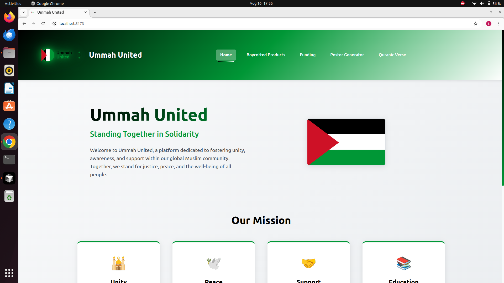

## 🌟 What Our Platform Does

Ummah United serves as a multi-functional platform that addresses various needs of the Muslim community, particularly in times of crisis and solidarity movements. Our website provides:

### 1. **Home & Community Hub** 🏠
- Welcome center for the global Muslim community
- Mission statement and core values presentation
- Call-to-action for community engagement
- Visual representation of Palestinian solidarity

### 2. **Boycotted Products Scanner** 📱
- **Product Search**: Search for brands and products to check boycott status
- **Barcode Scanner**: Scan product barcodes to instantly check boycott information
- **File Upload**: Upload product images for AI-powered brand identification
- **Real-time Database**: Access to updated boycott lists and brand information
- **Smart Suggestions**: Auto-complete suggestions for brand searches

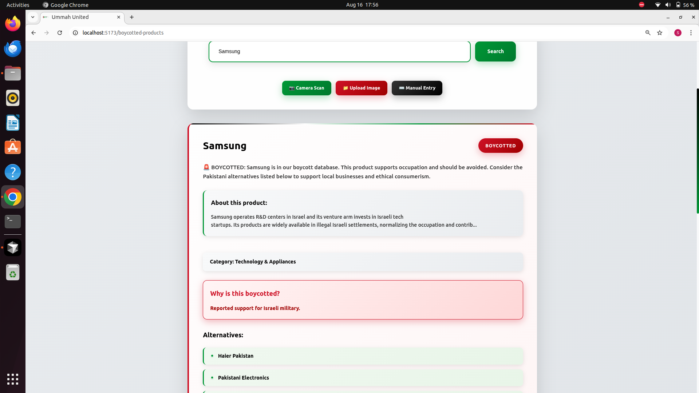
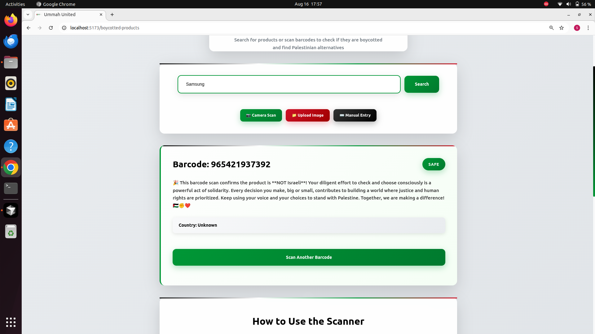

### 3. **Funding & Donation Platform** 💰
- **Verified Campaigns**: Curated list of legitimate fundraising campaigns
- **Multiple Categories**: Food aid, education, emergency relief, medical support
- **Direct Donation Links**: Secure connections to GoFundMe campaigns
- **AI-Powered FAQ**: Get instant answers about donation processes and campaigns
- **Progress Tracking**: Real-time updates on campaign goals and raised amounts

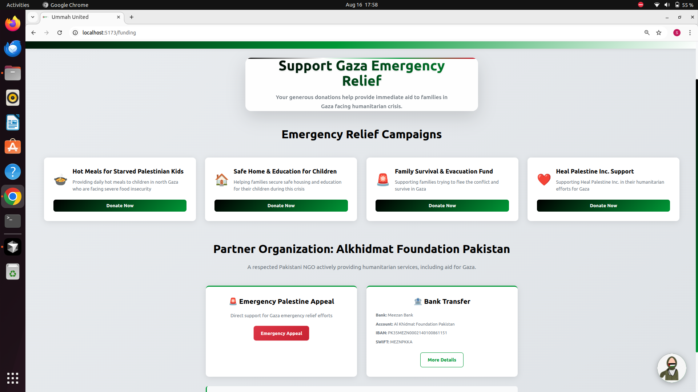
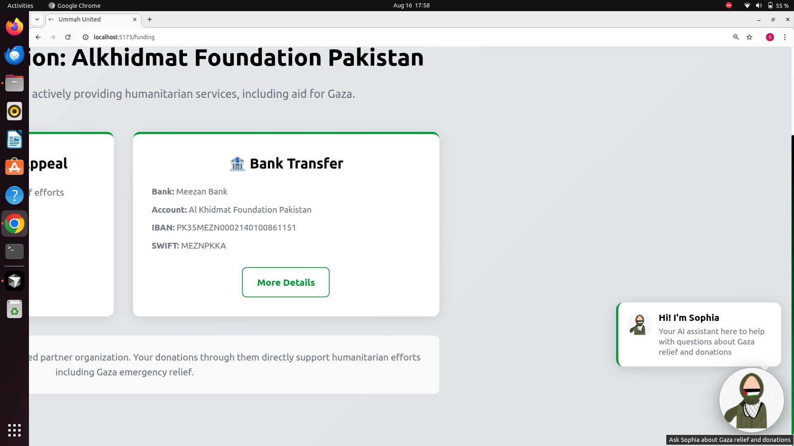
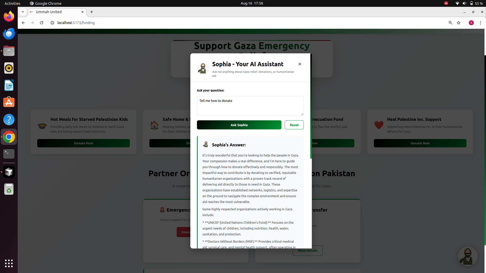

### 4. **AI Poster Generator** 🎨
- **AI-Powered Design**: Generate professional solidarity posters using artificial intelligence
- **Multiple Themes**: Hunger, Solidarity, and Voice themes that rotate automatically
- **Customizable Content**: Add your own titles, subtitles, and descriptions
- **Instant Download**: High-quality PNG files ready for printing or sharing
- **Modern Styles**: Choose from various design styles and layouts

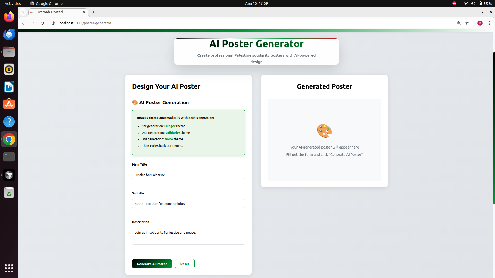
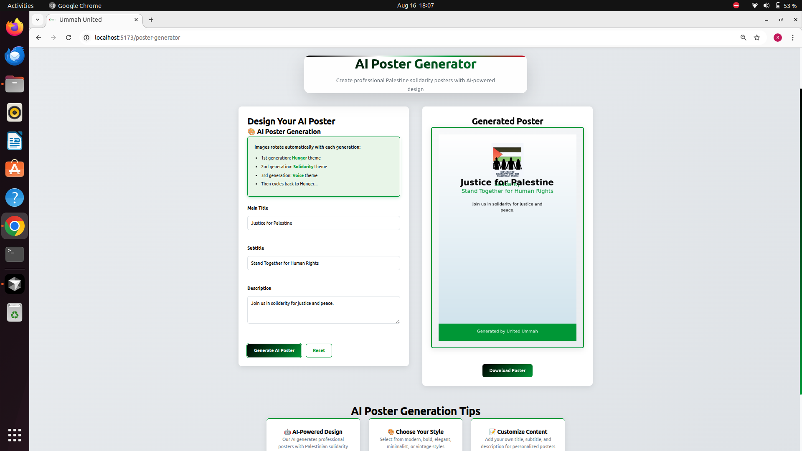

### 5. **Quranic Verse & Hadith Hub** 📖
- **Daily Verses**: Curated Quranic verses with translations and tafsir
- **Interactive Chatbot**: AI-powered Quranic guidance and answers
- **Daily Hadith**: Inspirational hadiths about unity, justice, and community
- **Educational Content**: Deep insights into Islamic teachings on solidarity
- **Multilingual Support**: Arabic text with English translations

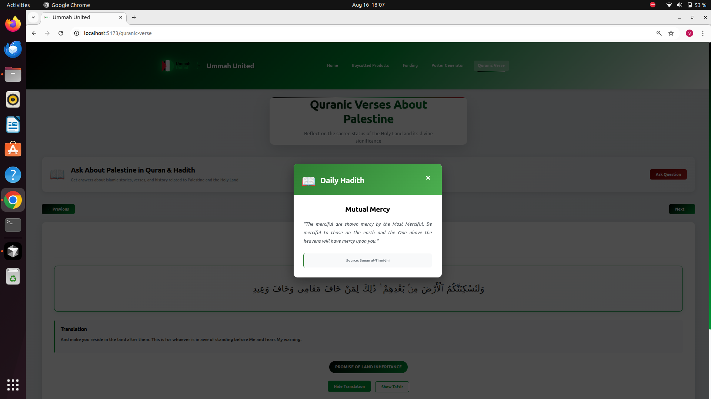
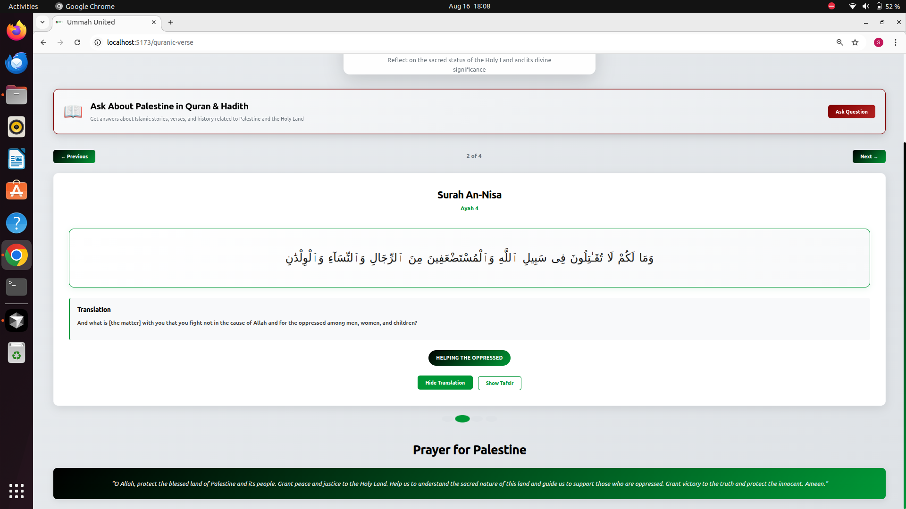
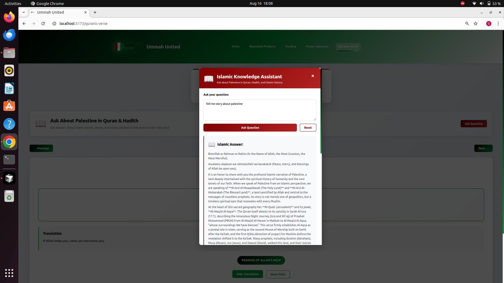

## 🚀 Key Features

### Technology Stack
- **Frontend**: React.js with modern CSS styling
- **Backend**: Python Flask API with AI integration
- **AI Services**: Gemini AI for poster generation and Quranic guidance
- **Database**: JSON-based data storage for boycott lists and campaigns
- **Responsive Design**: Mobile-friendly interface for all devices

### User Experience
- **Intuitive Navigation**: Clean, accessible interface
- **Real-time Updates**: Live data and AI responses
- **Multi-language Support**: Arabic and English content
- **Accessibility**: Designed for users of all abilities
- **Community Focus**: Built for collective action and support

## 🎯 Target Audience

- **Muslim Communities** worldwide seeking unity and solidarity
- **Activists** working for justice and human rights
- **Humanitarian Workers** coordinating relief efforts
- **Educators** teaching about Islamic values and community service
- **Individuals** wanting to make informed consumer choices
- **Organizations** seeking to support legitimate causes

## 🌍 Impact & Mission

Ummah United aims to:
- **Strengthen Community Bonds** through digital connectivity
- **Promote Informed Consumerism** through boycott awareness
- **Facilitate Humanitarian Aid** through verified donation channels
- **Inspire Action** through educational content and AI-powered tools
- **Build Solidarity** across borders and cultures

---

*"The believers, in their mutual kindness, compassion, and sympathy, are just like one body. When one of the limbs suffers, the whole body responds to it with wakefulness and fever."* - Sahih al-Bukhari

---

## 👥 Collaborators

We would like to express our deepest gratitude to the amazing team of collaborators who made Ummah United possible:

### 🌟 **Raheen** 
- **GitHub**: [@syedaraheen](https://github.com/syedaraheen)
- **Contribution**: Lead developer and project architect
- **Role**: Full-stack development, AI integration, and project coordination

### 🌟 **Wajiha** 
- **GitHub**: [@wajiha787](https://github.com/wajiha787)
- **Contribution**: AI Poster Generator development and design
- **Role**: Poster generation interface, AI integration, and creative design implementation

### 🌟 **Zainab** 
- **GitHub**: [@zainab318](https://github.com/zainab318)
- **Contribution**: Boycotted Products Scanner development
- **Role**: Product search functionality, barcode scanning, and boycott database integration

### 🌟 **Maimoona** 
- **Contribution**: Daily Code Generator for Quranic Verse section
- **Role**: Quranic verse generation, daily hadith implementation, and spiritual content development

### 🌟 **Aqsa** 
- **Contribution**: Funding & Donation Platform development
- **Role**: Campaign management interface and fundraising features implementation

---

**Special Thanks** 🙏

We are incredibly grateful for the dedication, creativity, and technical expertise that each collaborator brought to this project. Your commitment to building a platform that serves the global Muslim community is truly inspiring. Together, we've created something that will make a real difference in people's lives.

---

**Ummah United** - Standing Together in Solidarity 🤝
